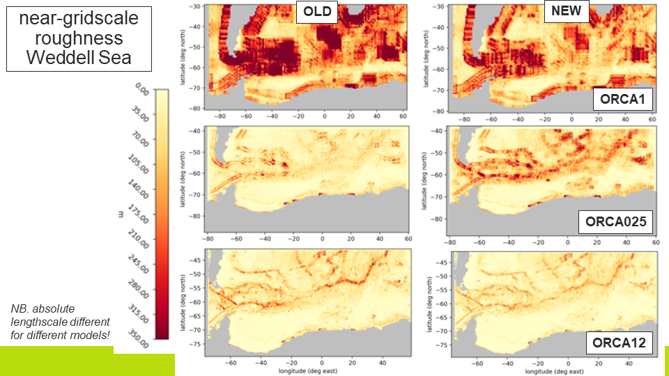

# GLOBAL_BATHYMETRY
This repository contains new global bathymetry datasets for ocean models using the ORCA family of 
grids ([Madec and Imbard (1996)](#madec_and_imbard_1996)). The source data set is [GEBCO 2021](#gebco_2021).
Horizonally regridded bathymetries are provided on the _eORCA1_, _eORCA025_, and _eORCA12_ grids 
(with nominal 1&deg;, 1/4&deg; and 1/12&deg; resolution respectively).

The  2D bathymetries on the model grid can be used to generate the model 3D grid and masks. This process 
depends on the choice of vertical coordinate. In this release we also provide 3D model grids and masks
for a z-level vertical grid with partial cells at the ocean floor.

The bathmetries and 3D grids and masks in this repository were created for use in the NEMO model 
([Madec et al (2019)](madec_et_al_2019)) and much of the processing uses grid definition files in 
NEMO format. In principle there is no reason why these grid and mask definitions should not be used
in other ocean models subject to the restriction that they are based on the Arakawa C-grid discretisation, 
with a land sea mask centred on tracer points. 

All code and scripts can be found in the _src_ directory and associated namelists, data files in
the _etc_ directory of this repository  unless otherwise stated.

## Table of contents
1. [Background and motivation](#background-and-motivation)
2. [Creation of model bathymetries](#creation-of-model-bathymetries)
   1. [Source dataset](#source-dataset)
   2. [Horizontal regridding](#horizontal-regridding)
   3. [Smoothing](...)
   4. [Reopening straits and channels](#checking-straits-and-sills)
3. [Projection onto model vertical grid](#projection-onto-model-vertical-grid)
4. [Test results](#test-results)
5. [References](#references)

## Background and motivation 

## Creation of model bathymetries
### Horizontal regridding
The nominal resolution of the [GEBCO 2021](#gebco_2021)  dataset is 15 arc seconds (although the effective
resolution over most of the domain is much less than this). The approach to horizontal regridding is to
take the median value of all source data points inside a model grid cell. The python code used is 
**bathy_regrid_horiz.py** which is based on the algorithm from [NEMOBAT](#nemobat) by J-M. Molines whereby
the model grid cells are approximated as quadrilaterals in latitude-longitude space. 

**General options:** A minimum depth at sea points of 3.0m was set using the _min_depth_ keyword. Note 
that as detailed below, the smoothing step effectively resets this to 5.0m. 

**Coastline:** A decision was made to maintain the same coastline as the previous _ORCA_ bathymetries to 
faciliate the use of the new bathymetries in coupled models, where a change in the surface land-sea mask
can necessitate a lot of work [what?]. This was achieved by setting the _mask_in_ keyword to True, which 
tells the routine to impose the land-sea mask from the mesh file on the new bathymetry. The choice to 
impose the old coastline raises the issue of how to set the ocean depth at points which would be land 
points based on GEBCO 2021 but were sea points with the old coastline. These were dealt with as follows.
 1. Recalculating the depth based on the median of only those source data points in the model grid cell that are below sea level.
 2. Remaining problematic points after step 1 are filled by iterative extrapolation from neighbouring sea points (set _fill_bad_cells_ keyword to True).
 3. Any remaining problematic points after steps 1 and 2 are set to the minimum depth (so long as the _min_depth_ keyword is set.) 

**Inland Seas:** Large inland seas such as the Caspian Sea, the North American Great Lakes and Lake Victoria 
in Africa are included in the ocean model primarily to provide a good lower boundary condition for the 
atmosphere in coupled models. The bathymetry of the inland seas is included in GEBCO, which provides topography
over land, but the elevation of the lake surfaces, which is required as a reference point for the lake 
bathymetries, is not provided. A very accurate simulation of the inland seas is not required in the context
of these global models, so the bathymetries of the inland seas have simply been copied from the previous 
bathymetries. NEMO provides masks to define the location of inland seas, and these masks have been used
to facilitate the masking out the inland seas in the input land-sea mask, and the subsequent copying of 
the old bathymetry using **closea_fill.py** and **closea_copy_bathy.py**. (Note that **bathy_regrid_horiz.py**
currently cannot deal with inland seas: it assumes ocean points are those with elevation below mean 
sea level).

### Smoothing
In order to avoid forcing the model at the gridscale, a single pass of a 2nd order Shapiro filter was applied, following the 
algorithm of [Francis (1975)](#francis_1975). MORE DETAILS OF ALGORITHM / CHOICES.

The smoothing was done using a modified version of the _cdfsmooth.f90_ module from the 
[CDFTools package](#molines_cdftools). The modified version is available at the 
[JMMP fork](#cdftools_jmmp) of the main repository. 

### ==== code block ====
````
  !!CHECK THAT THESE COMMANDS WORK!!
  closea_fill.py -C domcfg_eORCA025_v2.nc -M mesh_mask_eORCA025-GO6.nc \
                 -o tmask_eORCA025-GO6-CloseaFill.nc

  bathy_regrid_horiz.py -B GEBCO_2021_sub_ice_topo.nc -S gebco \
                        -M tmask_eORCA025-GO6-CloseaFill.nc -m \
                        -d3.0 -F -o bathy_eORCA025_noclosea_from_GEBCO2021.nc

  cdfsmooth -f bathy_eORCA025_noclosea_from_GEBCO2021_FillZero.nc -c 2 -t S \
            -n namelist_shapiro.txt
 
  closea_copy_bathy.py ...
````
where the namelist_shapiro.txt file was as follows:
````
&nam_shapiro
ln_npol_fold = .TRUE.
ln_ew_cycl = .TRUE.
ln_pass_shallow_updates = .TRUE.
ln_pass_fixed_pt_updates = .FALSE.
rn_min_val = 5.0
/
````

### Reopening straits and channels
Where narrow strait and channels are only marginally (or not) resolved by the model grid, the 
horizonal regridding and smoothing process will partially or fully block these channels. There are 
many examples of channels in the global ocean which have throughflows, exchange flows or overflows
which are very important for interbasin exchange of water masses. For these channels we apply hand
editing of the smoothed bathymetry to reset the ocean depths in the channels with the aim of
modelling approximately the correct volume throughflow or exchange. 

Since the channels in question are not fully resolved, this process can be viewed as a crude
subgrid parametrisation. The channels are reset to approximately the observed channel depth, and
the model integrated for a few decades. If the volume flow through the channel is judged to be still too
far from the observed estimates, the depth in the channel can be adjusted, or alternatively the 
side or bottom friction in the channel changed. Typically for a low resolution model a single-point 
channel in the model can be much wider than the real channel and so prone to allowing too much
throughflow, and this can be mitigated by increasing the bottom or side friction in the model. 
The bathymetries in this repository were created for use in the NEMO model. Global NEMO configurations
are typically run with a free-slip lateral boundary condition; in order to reduce flow in some of the
channels we change the slip-condition in the channels to a partial slip or no slip condition.

Note that it is also possible in NEMO configurations to adjust the width of channels by adjusting 
the horizontal scale factors _e1t_ and _e2t_ locally but we have not done that for these configurations. 

The channels and flows that were checked were the North Atlantic overflows: Denmark Strait and Faroe
Bank Channel; exchanges with marginal seas: Gibraltar Strait, Bab el Mandeb and Strait of Hormuz; 
and the exit channels for the Indonesian Throughflow: Lombok Strait, Ombai Strait and Timor Channel.
For ORCA1, it was found necessary to edit all of these apart from the Strait of Hormuz. For ORCA025,
it was found necessary to edit the Denmark Strait, Faroe Bank Channel, Strait of Gibraltar, Bab el
Mandeb and the Lombok Strait. For ORCA12, no editing was necessary. The code used to reset the 
bathymetry at chosen points was edit_field.py with associated data files ...


### Creation of 3D model grids and masks

## Test results



## References

<a name="molines_cdftools"></a>
https://github.com/meom-group/CDFTOOLS

<a name="cdftools_jmmp"></a>
https://github.com/JMMP-group/CDFTOOLS, hash code: 136b95b6ac4fefad6973a4c15ca953dcae65dfc6

<a name="gebco_2021"></a>
GEBCO Compilation Group (2021): _GEBCO 2021 Grid_, doi:10.5285/c6612cbe-50b3-0cff-e053-6c86abc09f8f

<a name="francis_1975"></a>
_Francis, M. (1975): _The use of a multipoint filter as a dissipative mechanism in a
numerical model of the general circulation of the atmosphere_, Quart. J. Roy. Met. Soc. (1975), 101, pp. 567-582,_
https://doi.org/10.1002/qj.49710142913

<a name="madec_and_imbard_1996"></a>
Madec, G. and Imbard, M. (1996): _A global ocean mesh to overcome the North Pole singularity_, Climate Dynamics, 12, 381–388,
https://doi.org/10.1007/BF00211684

<a name="madec_et_al_2019"></a>
Madec, G. and system team, N.: Nemo Ocean Engine - version 4.0.1, Notes du Pôle de modélisation de l’Institut Pierre-Simon Laplace
(IPSL): (27)., https://doi.org/10.5281/zenodo.3878122, 2019

<a name="nemobat"></a>
Molines, J.-M., NEMOBAT, https://github.com/molines/NEMOBAT